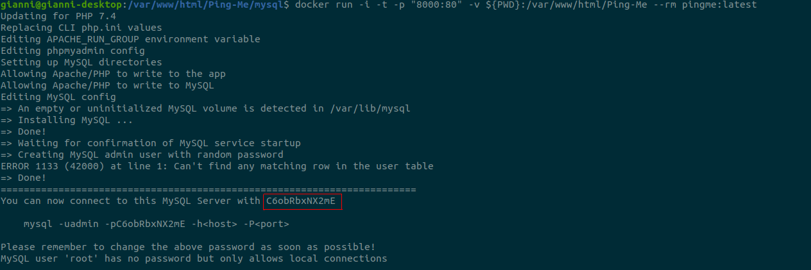

 

# Ping-Me

## Contexte

### Explications / Présentation

Ce projet entre dans le cadre du cours de **CyberSécurité** du Semestre 1 de 1ère année de Master III à l'Université Catholique de Lille, FGES.

Le sujet est le suivant : création d'un site web volontairement vulnérable (**contenant des failles de sécurité**) et analyse de sécurité / propositions pour combler ces failles. Les technologies utilisées ainsi que les fonctionnalités proposées sont libres.

### To-do

- Le projet doit pouvoir être **lancé avec une commande docker** (et donc doit avoir un Dockerfile). 
   - Si la commande Docker ne fonctionne pas, la note sera sévère parce que je vais pas débugger le code de 30 personnes.
   - La commande doit apparaitre dans /README.md
- Le projet doit faire apparaitre un **dossier /tests** qui contiendra les tests unitaires qui permettraient de trouver les vulnérabilités dans votre code (vous avez carte blanche sur votre framework de test)
  - Par exemple : Un test d'injection SQL sur un paramètre GET
- Le projet doit faire un apparaitre un **dossier /exploit** qui contiendra les scripts qui permettront d'exploiter les vulnérabilités (vous avez carte blanche sur le langage du script, il faut que le script soit concis)
- Le projet doit être un **dépôt github publique**, pour que je puisse y jeter des coups d'oeil et pour les corrections
-  Le **code doit être lisible et donc correctement commenté** pour quelqu'un qui n'est pas dev (genre moi) mais qui sait lire de code (pas de "i++; // on incrémente i"). Si le code n'est pas propre et me fait perdre du temps quand je le lis, il y aura des malus.
- Le fichier README.md doit faire apparaitre les **objectifs de sécurité** de l'application :
  - Ses objectif en Confidentialité, Intégrité et Disponibilité (note /5)
- Le fichier README.md doit faire apparaitre un **graph mermaidjs** avec la surface d'attaque
- Un fichier Excel avec la même **analyse de sécurité** que le premier TP doit aussi apparaitre.

## Présentation du projet

### Description

Ping-Me est un Site Web sur le thème du Tennis de Table. Il représente l'ébauche d'un **simulateur de compétition de Tennis de Table**.

Ce projet a été créé **à partir de zéro et uniquement pour le projet de Cybersécurité**.

### Fonctionnalités

- Inscription
- Connexion
- Création / modification des données de la raquette / des revêtements
- Visualisation d'un ratio [ victoires - défaires ]
- Affrontement avec d'autres joueurs

### Technologies utilisées

Le projet est un site web réalisé avec **PHP7, HTML, CSS, Javascript, JQuery, SQL**.

Le site se lance via **apache**.

#### Pourquoi ce choix

Ayant l'habitude de développer sous Symfony (framework PHP), je me suis rapidement dirigé vers ce choix car c'est avant tout un sujet sur le cybersécurité et non sur le développement en soit. (je voulais donc une **technologie sur laquelle j'étais le plus à l'aise**) J'ai délaissé le framework Symfony pour ce projet car beaucoup de failles sont comblées / empêchées par le framework. En PHP natif, créer des failles est beaucoup plus simple et approprié.

## Installation et utilisation

### Installation

Un Dockerfile est présent à la racine du projet et va permettre l'installation des dépendances du projet, à savoir :
- Apache
- Mysql
- PHP

Pour installer le projet, il faudra **se positionner à la racine du projet** et lancer les commandes suivantes :

```
docker build -t "pingme:latest" .
docker run -i -t -p "8000:80" -v ${PWD}:/var/www/html/Ping-Me --rm pingme:latest
```

Il faudra alors installer la base de données en se connectant à phpmyadmin via l'adresse suivante :

`http://127.0.0.1:9000/phpmyadmin`

Et s'y connecter avec l'utilisateur **root** en utilisant le mot de passe généré aléatoirement et affiché dans la console comme l'indique le screen ci-dessous :



Il faudra alors cliquer sur **Importer** et charger le script **pingme.sql** présent à la racine du projet. (ce dump va créer la base de données avec ses tables)

L'application sera alors accessible via navigateur à l'adresse suivante :

`127.0.0.1:8000/Ping-Me`

## Sécurisation de l'application

### Diagramme Mermaid : Surface d'attaque


### Les critères DICT

**Disponibilité**

Il n'y a aucune information visible de la part d'un joueur sur les autres joueurs du jeu. Il peut uniquement voir la liste des autres joueurs ainsi que leur ratio [victoires - défaites]. Ce dernier pouvant indiquer si un joueur est plutôt fort ou faible, cela peut être intéressant pour le choix d'adversaire lors d'une compétition. J'estime donc que la disponibilité devrait être à **1/5**.

**Intégrité**

Il est très important pour un joueur que ses données (notamment le matériel) ainsi que celles des autres joueurs (ratio compétition) restent inchangées et exactes car ayant peu d'informations, il est primordial que celles-ci soient les bonnes. J'estime donc que l'intégrité devrait être à **5/5**.

**Confidentialité**

Il est important pour un joueur de ne pas voir ses informations sur son équipement actuel dévoilées aux autres joueurs. Il serait alors trop facile aux joueurs de choisir leurs adversaires en prenant les combinaisons les plus faibles. C'est pour cette raison que j'estime que la confidentialité devrait être à **4/5**.

**Traçabilité**

Dans le cadre d'une application de simulation d'un joueur de tennis de table, il n'est pas essentiel d'avoir un historique des actions menées par le joueur et / ou ses adversaires. Il serait cependant intéressant pour lui de pouvoir consulter un historique de ses victoires / défaites avec les statistiques de sa raquette / de ses revêtements à chaque match afin qu'il puisse étudier quelle est la meilleure combinaison possible. C'est pour cette raison que j'estime que la traçabilité devrait être à **0/5**.
